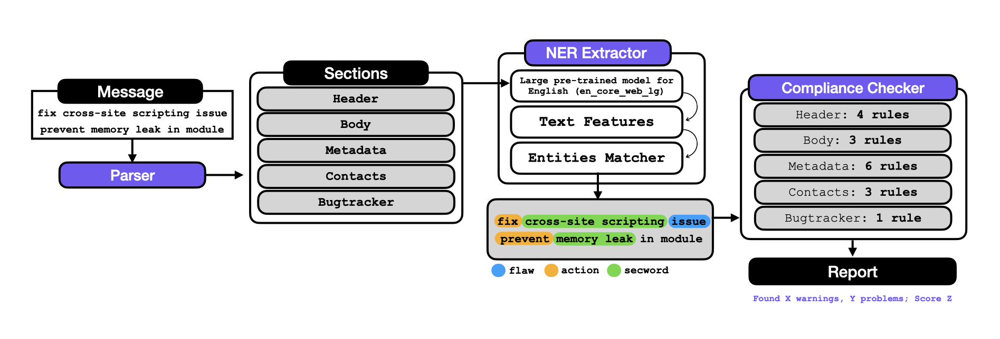

# Architecture

The figure shows the different components of 
SECOMlint's engine and the information flow for one run of it.
The tool takes as input a commit message which is parsed 
and divided into different sections: **header**, **body**, **metadata**,
**contact** and **bug-tracker** references.

 

 

For each of those sections, the tool applies the Named Entity Recognition (NER) 
extractor. NER (or entity chunking) is a technique used in the natural 
language processing field to identify and extract key information, 
also known as entities, in the text. Entities may be organizations, 
people's names, company names, and more. [Spacy](https://spacy.io) provides
language processing pipelines that take the text and perform 
several different pre-processing steps such as *tokenization* (segment 
text into tokens), *tagger* (assign part-of-speech tags), 
*parser* (assign dependency labels between tokens), and *NER* (detect 
and label named entities). The different steps can be enabled, disabled, or 
replaced by new rule-based models, i.e., steps such as NER can 
be replaced by new rule-based models to extract new types of 
entities. 

From a large empirical analysis of security commit messages conducted in our research team,
we noticed some groups of keywords that could represent different 
entities, such as vulnerability IDs, weakness IDs, severity,
security-related words, and more. These groups of keywords or 
patterns can be translated into rules and used by the NER step 
in the spacy pipeline to extract the set of entities designed.

 

# Entities

The table shows the different types of entities 
we end up designing. Some of the entities are not security 
specific but important since they are patterns that come from 
applying generic commit messages best practices, e.g., references to 
issues (\#NUMBER).

<table>
	<tr>
	    <td>entity</td>
	    <td>rationale</td>
	</tr>
	<tr>
	    <td>ACTION</td>
	    <td>A commit usually implies an action: adding some features, fixing a problem, refactoring code, and more.</td>
	</tr>
	<tr>
	    <td>FLAW</td>
	    <td>Fixing a security vulnerability usually implies fixing a flaw (e.g., problem,
        defect, issue, weakness, flaw, fault, bug, error, etc.).</td>
	</tr>
	<tr>
	    <td>VUNLID</td>
	    <td>Known vulnerability ids: CVE, GHSA, OSV, etc.</td>
	</tr>
    <tr>
	    <td>CWEID</td>
	    <td>Vulnerability type (CWE-ID/Weakness name).</td>
	</tr>
    <tr>
	    <td>ISSUE</td>
	    <td>The GitHub issue number or pull request sometimes is referenced in commit messages.</td>
	</tr>
    <tr>
	    <td>EMAIL</td>
	    <td>Contact e-mails of reviewers and authors usually appear after tags such as `Reported-by`.</td>
	</tr>
    <tr>
	    <td>URL</td>
	    <td>Vulnerability reports or blog posts; and bug-trackers references.</td>
	</tr>
    <tr>
	    <td>SHA</td>
	    <td>Sometimes commit hashes are mentioned to reference where the vulnerability was introduced.</td>
	</tr>
    <tr>
	    <td>VERSION</td>
	    <td>Software versions are sometimes important to find mentions of 
        malicious software.</td>
	</tr>
    <tr>
	    <td>SEVERITY</td>
	    <td>Vulnerability severity: low, medium, high, critical.</td>
	</tr>
    <tr>
	    <td>DETECTION</td>
	    <td>Vulnerabilities are detected manually or using specific tools (such as codeql, coverity, oss-fuzz, libfuzzer, and more).</td>
	</tr>
    <tr>
	    <td>SECWORD</td>
	    <td>Words or group of words that were identified as security-relevant 
        in previous work [1](https://dl.acm.org/doi/10.1145/3463274.3463331),[2](https://dl.acm.org/doi/10.1145/3475716.3475781).</td>
	</tr>
</table>

The extractor uses a pre-trained model provided by spacy to parse and
extract important features of the text. Some of these features, such as the 
part-of-speech tags, are used in the NER rules to improve precision. For
instance, an action implies a verb; therefore, we only extract keywords
like `fix`, `patch`, `prevent`, etc, when the speech tag is a verb.
After extracting the different entities per section, the tool applies the different
sets of section rules. For some rules, 
the compliance checker takes into account the types of entities 
that are expected to obtain. For instance, for the rule [header-ends-with-vuln-id](secomlint-rules.md#header-ends-with-vuln-id),
it is expected that the header line (first line of the message) ends
with an entity type of `VULNID`.

